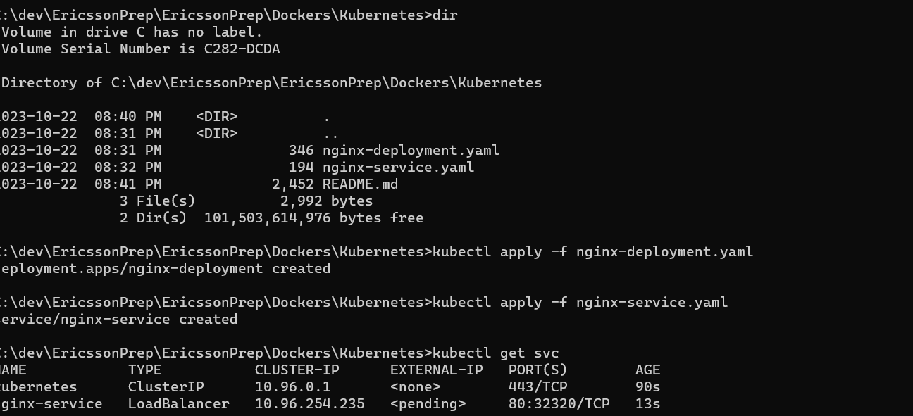

# Kubernetes with kind and Dockerized Application Deployment

This guide will walk you through setting up a Kubernetes cluster using `kind` (Kubernetes in Docker) and deploying a Dockerized application in a few easy steps. 


## Prerequisites

- [Docker](https://www.docker.com/get-started) installed on your system.
- [kubectl](https://kubernetes.io/docs/tasks/tools/install-kubectl/) (Kubernetes command-line tool) installed on your system.
- A Docker image of the application you want to deploy.

## Installation and Setup

### 1. Install `kind`

To install `kind`, follow these steps:

1. Visit the Kind GitHub releases page: https://github.com/kubernetes-sigs/kind/releases
2. Download the Windows binary (`.exe`) for your system (e.g., `kind-windows-amd64`).
3. Rename the binary to `kind.exe`.
4. Move `kind.exe` to a directory in your system's PATH (e.g., `C:\Windows\System32`).

Verify the installation by running:

```bash
kind version
2. Create a Kubernetes Cluster
Use kind to create a Kubernetes cluster with the default name "kind":

bash
Copy code
kind create cluster
3. Deploy Your Application
Assuming you have the following YAML files:

nginx-deployment.yaml for Deployment.
nginx-service.yaml for Service.
Apply them using kubectl:

bash
Copy code
kubectl apply -f nginx-deployment.yaml
kubectl apply -f nginx-service.yaml
4. Access Your Application
Depending on the service type used in nginx-service.yaml (LoadBalancer, NodePort, or ClusterIP), access your application accordingly.
```
5. Clean Up
When you're done, delete the cluster and its resources:

```
kind delete cluster
```
Troubleshooting
1. Unable to Connect to Kubernetes Cluster
If you encounter the error "Unable to connect to the server: dial tcp 127.0.0.1," ensure that your Kubernetes cluster is running, and you have configured kubectl correctly. Use kubectl config use-context to set the current context.

2. Kind Installation Issues
If you face issues with kind installation, make sure you've downloaded the correct Windows binary, renamed it to kind.exe, and placed it in a directory in your system's PATH.

3. Exec Format Error
The "Exec format error" typically indicates a binary mismatch. Ensure you've downloaded the correct Windows binary of kind and that it's in your PATH.

Additional Resources
kind GitHub Repository
Kubernetes Official Documentation
Docker Official Documentation


